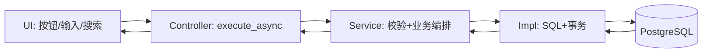
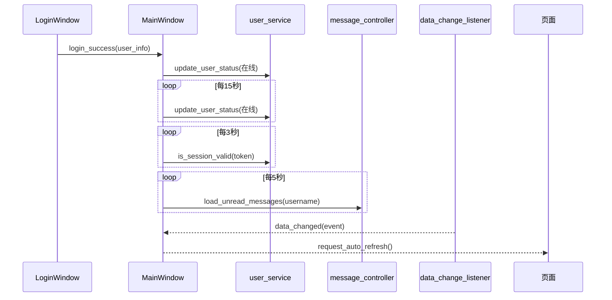

# 00_系统总览与分层架构

## 1. 系统定位
上一版系统是基于 `PyQt5 + QFluentWidgets` 的桌面 MES，重点覆盖：用户认证、权限可见性、产品与参数、生产订单流转、首件检验、维修闭环、消息中心、查询分析、插件工具。

## 2. 目录与职责
- `src/ui`：页面交互、弹窗、表格渲染、定时刷新触发。
- `src/controller`：接收 UI 行为，统一转调 service，并通过 Qt 信号回传结果。
- `src/service`：业务语义层，承担校验、流程编排、跨模块调用。
- `src/impl`：数据库执行层，包含大量业务 SQL 与核心流转算法。
- `src/utils`：初始化、数据库适配、日志、缓存、跨端事件等基础设施。

## 3. 主调用链

## 4. 运行期关键机制
1. 主窗口定时器
- 消息拉取：5 秒
- 在线心跳：15 秒
- 会话有效性：3 秒

2. 跨端同步
- PostgreSQL `LISTEN/NOTIFY` 通道：`scglxt_data_change`
- 发布入口：`utils/data_change_tool.py`
- 订阅入口：`DataChangeListener`

3. 缓存
- 模块内缓存：各 Impl 自带 `_get/_set/_clear_cache`
- 全局 SQL 缓存：`utils/db_cache_tool.py`

## 5. 页面总览（son_page）
- `user_management_page.py`
- `product_management_page.py`
- `product_parameter_management_page.py`
- `product_parameter_query_page.py`
- `production_order_management_page.py`
- `production_order_query_page.py`
- `production_data_query_page.py`
- `quality_data_query_page.py`
- `repair_order_query_page.py`
- `first_article_management_page.py`
- `message_center_page.py`
- `plugin_tool_page.py`

## 6. 关键入口文件
- 启动：`src/main.py`
- 主窗体：`src/ui/main_window.py`
- 通用服务容器：`src/service/common_service.py`
- 数据库适配：`src/utils/postgresql_adapter.py`
- 权限可见性：`src/impl/user_impl.py` + `resources/json/visibility_config.json`

## 7. 系统级时序（登录后）

