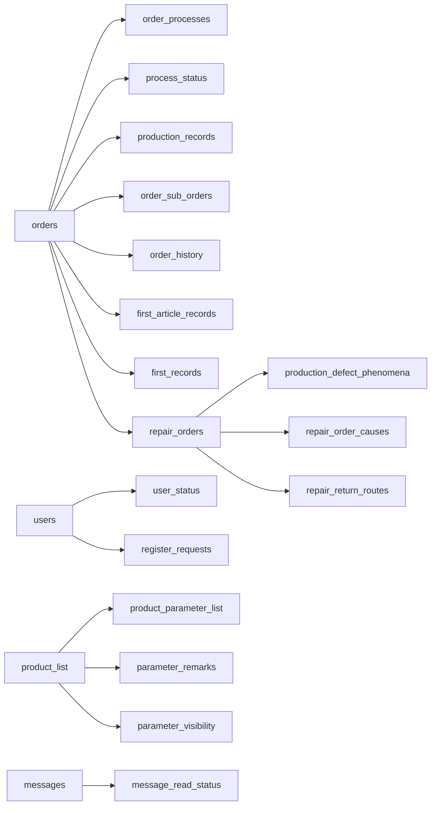

# 14_?????_???_??SQL

## 1. ????
- ???`src/utils/postgresql_adapter.py:get_db_schema`?

## 2. ????
| ?? | ??? | ??/???? | ???????? |
| --- | --- | --- | --- |
| assist_authorizations | 13 | id SERIAL PRIMARY KEY | id SERIAL PRIMARY KEY?order_id VARCHAR(50) NOT NULL?process_name VARCHAR(100) NOT NULL?target_role_name VARCHAR(100)?requester_username VARCHAR(100) NOT NULL?helper_username VARCHAR(100) NOT NULL?reason TEXT?status VARCHAR(20) NOT NULL DEFAULT '待审批' |
| daily_verification_codes | 4 | id SERIAL PRIMARY KEY | id SERIAL PRIMARY KEY?date VARCHAR NOT NULL?code VARCHAR NOT NULL?created_at TIMESTAMP DEFAULT CURRENT_TIMESTAMP |
| first_article_records | 11 | id SERIAL PRIMARY KEY | id SERIAL PRIMARY KEY?order_id VARCHAR NOT NULL?product_model VARCHAR NOT NULL?process_name VARCHAR NOT NULL?first_time TIMESTAMP NOT NULL?content TEXT?test_value TEXT?result VARCHAR NOT NULL |
| first_records | 11 | id SERIAL PRIMARY KEY | id SERIAL PRIMARY KEY?order_id VARCHAR NOT NULL?product_model VARCHAR?process_name VARCHAR?first_time TIMESTAMP DEFAULT CURRENT_TIMESTAMP?content TEXT?test_value TEXT?result VARCHAR |
| message_read_status | 6 | id SERIAL PRIMARY KEY?<UNIQUE> UNIQUE(message_id, username) | id SERIAL PRIMARY KEY?message_id INTEGER NOT NULL?username VARCHAR NOT NULL?is_read BOOLEAN DEFAULT FALSE?read_at TIMESTAMP?<UNIQUE> UNIQUE(message_id, username) |
| messages | 10 | id SERIAL PRIMARY KEY | id SERIAL PRIMARY KEY?sender VARCHAR NOT NULL?recipient VARCHAR?title VARCHAR?content TEXT NOT NULL?message_type VARCHAR DEFAULT 'system'?related_order_id VARCHAR?is_read BOOLEAN DEFAULT FALSE |
| order_history | 8 | id SERIAL PRIMARY KEY | id SERIAL PRIMARY KEY?order_id VARCHAR NOT NULL?old_status VARCHAR?new_status VARCHAR?operation VARCHAR?operator VARCHAR?operation_time TIMESTAMP DEFAULT CURRENT_TIMESTAMP?remark TEXT |
| order_processes | 12 | id SERIAL PRIMARY KEY | id SERIAL PRIMARY KEY?order_id VARCHAR NOT NULL?process_name VARCHAR NOT NULL?status VARCHAR DEFAULT '待生产'?operator VARCHAR?remark TEXT?process_order INTEGER DEFAULT 0?start_time TIMESTAMP |
| orders | 14 | order_id VARCHAR PRIMARY KEY?order_code VARCHAR UNIQUE | order_id VARCHAR PRIMARY KEY?order_code VARCHAR UNIQUE?product_id INTEGER?product_model VARCHAR?quantity INTEGER NOT NULL?produced_quantity INTEGER DEFAULT 0?status VARCHAR DEFAULT '待生产'?start_date DATE |
| parameter_remarks | 8 | id SERIAL PRIMARY KEY | id SERIAL PRIMARY KEY?product_id INTEGER?product_name VARCHAR?param_name VARCHAR?modify_time TIMESTAMP DEFAULT CURRENT_TIMESTAMP?old_value TEXT?new_value TEXT?remark TEXT |
| parameter_visibility | 5 | id SERIAL PRIMARY KEY | id SERIAL PRIMARY KEY?product_id INTEGER?param_name VARCHAR?role VARCHAR?visible INTEGER DEFAULT 1 |
| plugins | 9 | id SERIAL PRIMARY KEY | id SERIAL PRIMARY KEY?plugin_name VARCHAR NOT NULL?plugin_code TEXT NOT NULL?version VARCHAR?author VARCHAR?description TEXT?status VARCHAR NOT NULL?created_at TIMESTAMP DEFAULT CURRENT_TIMESTAMP |
| process_status | 8 | id SERIAL PRIMARY KEY | id SERIAL PRIMARY KEY?order_id VARCHAR NOT NULL?process_name VARCHAR NOT NULL?status VARCHAR?product_quantity INTEGER DEFAULT 0?ongoing_users TEXT DEFAULT ''?created_at TIMESTAMP DEFAULT CURRENT_TIMESTAMP?updated_at TIMESTAMP DEFAULT CURRENT_TIMESTAMP |
| product_list | 4 | id SERIAL PRIMARY KEY | id SERIAL PRIMARY KEY?product_name VARCHAR NOT NULL?created_at TIMESTAMP DEFAULT CURRENT_TIMESTAMP?updated_at TIMESTAMP DEFAULT CURRENT_TIMESTAMP |
| product_parameter_list | 7 | id SERIAL PRIMARY KEY | id SERIAL PRIMARY KEY?param_name VARCHAR NOT NULL?param_category VARCHAR NOT NULL?param_type VARCHAR NOT NULL?param_value TEXT NOT NULL?product_id INTEGER DEFAULT 0?process_name VARCHAR DEFAULT '所有工序' |
| production_records | 6 | id SERIAL PRIMARY KEY | id SERIAL PRIMARY KEY?order_id VARCHAR NOT NULL?process_name VARCHAR?production_time TIMESTAMP DEFAULT CURRENT_TIMESTAMP?production_quantity INTEGER?operator VARCHAR |
| register_requests | 6 | id SERIAL PRIMARY KEY | id SERIAL PRIMARY KEY?username VARCHAR NOT NULL?password VARCHAR NOT NULL?role VARCHAR DEFAULT '系统管理员'?created_at TIMESTAMP DEFAULT CURRENT_TIMESTAMP?status VARCHAR DEFAULT '待处理' |
| repair_return_routes | 9 | id SERIAL PRIMARY KEY | id SERIAL PRIMARY KEY?repair_order_id VARCHAR(64) NOT NULL?source_order_id VARCHAR(50) NOT NULL?source_process_name VARCHAR(100) NOT NULL?target_process_name VARCHAR(100) NOT NULL?return_quantity INTEGER NOT NULL?operator VARCHAR(100)?created_at TIMESTAMP DEFAULT CURRENT_TIMESTAMP |
| user_status | 4 | user_id INTEGER PRIMARY KEY | user_id INTEGER PRIMARY KEY?status VARCHAR DEFAULT '离线'?last_updated TIMESTAMP DEFAULT CURRENT_TIMESTAMP?session_token VARCHAR |
| users | 10 | id SERIAL PRIMARY KEY?username VARCHAR UNIQUE NOT NULL | id SERIAL PRIMARY KEY?username VARCHAR UNIQUE NOT NULL?password VARCHAR NOT NULL?role VARCHAR NOT NULL?account_type VARCHAR(20) DEFAULT 'human'?owner_user_id INTEGER?device_code VARCHAR(100)?max_parallel_sub_orders INTEGER DEFAULT 1 |

## 3. ???

## 4. ??SQL??
- ???`src/impl/user_impl.py`
- ???`src/impl/product_impl.py`
- ??/???`src/impl/order_impl.py`
- ???`src/impl/inspection_impl.py`
- ??/???`src/impl/plugin_impl.py`

## 5. ?????
- users ????
- order_sub_orders.is_visible
- process_status.ongoing_users
