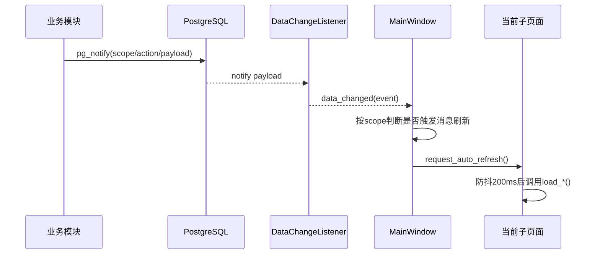

# 15_跨模块事件_缓存_自动刷新机制

## 1. 模块职责与边界
- 职责：描述旧系统如何在多窗口/多终端场景下实现“数据改动后自动刷新”，并控制缓存一致性与刷新频率。
- 关注对象：
  - 事件总线：`src/utils/data_change_tool.py`
  - 页面自动刷新基类：`src/ui/son_page/base_sub_page.py`
  - 主窗口调度：`src/ui/main_window.py`
  - 查询缓存：`src/utils/db_cache_tool.py`
- 边界：不定义业务规则，仅定义“变更传播机制”。

## 2. 入口与调用链
1. Service/Controller 在写操作后调用 `data_change_tool.notify_change(...)`。
2. PostgreSQL `pg_notify` 将事件发到 `scglxt_data_change`。
3. 客户端 `DataChangeListener` 线程 `LISTEN` 到事件并发出 Qt 信号。
4. `MainWindow.on_data_changed` 根据当前页面类型触发刷新。
5. `BaseSubPage.request_auto_refresh` 防抖后调用约定加载方法。

## 3. 事件模型
- 通道：`scglxt_data_change`
- 标准负载：
  - `scope`（如 `order/user/product/message/all`）
  - `action`（如 `created/updated/deleted/mark_read`）
  - `timestamp`
  - 附加业务字段（可选）
- 解析策略：`_parse_payload` 支持 JSON 对象、非 JSON 降级为 `raw_payload`。

## 4. 主窗口刷新时序

## 5. 页面自动刷新约定
- `BaseSubPage._load_data_by_convention` 固定顺序尝试：
  1. `load_data`
  2. `load_messages`
  3. `load_users`
  4. `load_products`
  5. `load_params`
  6. `load_product_parameters`
  7. `load_orders`
  8. `load_plugins`
  9. `load_tools`
  10. `load_first_articles`
- 规则：页面只需实现其中一个标准方法即可接入自动刷新。

## 6. 缓存模型
### 6.1 全局 SQL 缓存（DBCacheTool）
- 结构：`OrderedDict` 实现 LRU。
- 键：`md5(sql + params-json)`。
- 参数：`default_expire_time=30s`、`max_cache_size=1000`、`cleanup_interval=300s`。
- 统计：命中率、命中次数、未命中次数。

### 6.2 模块级缓存
- 各 Impl 维护 `_get/_set/_clear_cache`。
- 写操作后调用 `_clear_cache`，并常伴随 `db_cache.clear()`。

## 7. 定时器与轮询
- 主窗口消息轮询：5 秒。
- 在线心跳（写 `user_status`）：15 秒。
- 会话有效性检查：3 秒。
- 页面 showEvent 首次渲染后异步加载（`QTimer.singleShot(0, ...)`）。

## 8. 并发与一致性机制
- 事件驱动 + 轮询兜底并存：
  - 事件用于跨端“尽快刷新”。
  - 轮询用于事件丢失兜底。
- 防抖机制抑制事件风暴导致的重复刷新。
- 写事务完成后再发事件，降低脏读窗口。

## 9. 失败路径与补偿
1. LISTEN 连接失败：监听线程打印 warning 后 1s 重连。
2. notify 失败：不阻断主业务提交。
3. 页面当前不可见：先记录 `_pending_auto_refresh`，显示后再刷新。
4. 刷新方法异常：只影响当前页面，不中断主窗口。

## 10. 与其他模块耦合点
- 用户模块：在线状态心跳与会话守护。
- 消息模块：message scope 事件驱动消息拉取。
- 订单/产品/参数模块：写后发事件驱动查询页自动更新。

## 11. 观测与排障建议
1. 查 `MainWindow.on_data_changed` 是否收到事件。
2. 查 `DataChangeListener` 是否重连成功。
3. 查写操作后是否调用 `notify_change`。
4. 查缓存是否被清理（命中率异常高时可能数据陈旧）。

## 12. 回归测试场景（10条）
1. A 端修改订单，B 端订单页自动刷新。
2. A 端改用户状态，B 端用户管理在线状态更新。
3. 消息发送后 5 秒内可见新消息。
4. 监听线程断线后可自动恢复并继续接收事件。
5. 高频写入下页面不会每次都立刻全量刷新（防抖生效）。
6. 页面隐藏期间收到事件，切回后能补刷新。
7. 清理缓存后查询结果立即更新。
8. 禁用缓存情况下功能正确但响应变慢。
9. 退出应用后监听与定时器停止。
10. 多页面切换不会出现循环刷新或卡死。

## 13. 源码定位索引
- `src/utils/data_change_tool.py`
- `src/utils/db_cache_tool.py`
- `src/ui/main_window.py`
- `src/ui/son_page/base_sub_page.py`
