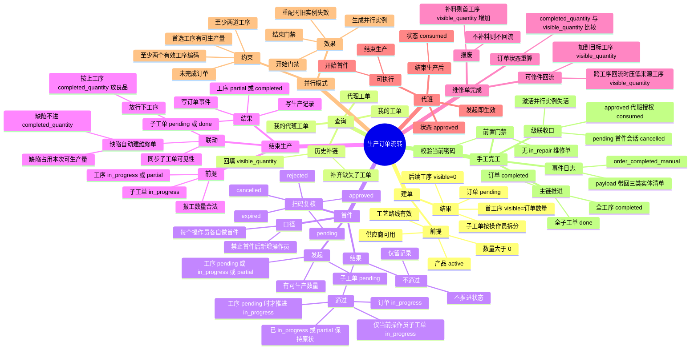
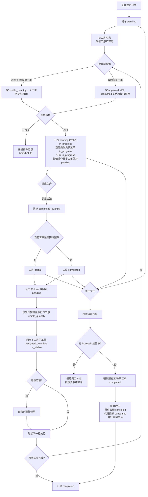
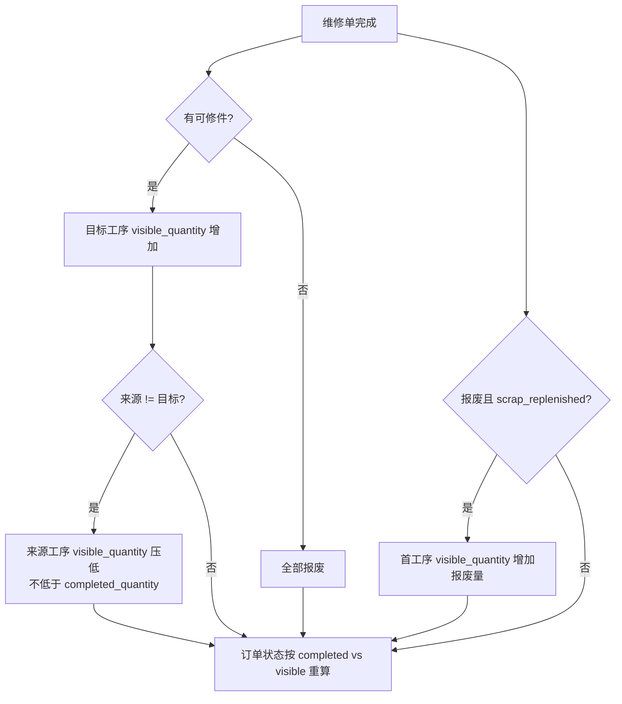

# 生产订单流转思维导图

## 1. 思维导图

```mermaid
mindmap
  root((生产订单流转))
    建单
      前提
        产品 active
        供应商可用
        工艺路线有效
        数量大于 0
      结果
        订单 pending
        首工序 visible=订单数量
        后续工序 visible=0
        子工单按操作员拆分
    查询
      我的工单
      代理工单
      我的代班工单
      历史补链
        回填 visible_quantity
        补齐缺失子工单
    首件
      口径
        每个操作员各自做首件
        禁止首件后新增操作员
      发起
        工序 pending 或 in_progress 或 partial
        子工单 pending
        有可生产数量
      结果
        通过
          工序 pending 时才推进 in_progress
          已 in_progress 或 partial 保持原状
          仅当前操作员子工单 in_progress
          订单 in_progress
        不通过
          仅留记录
          不推进状态
      扫码复核
        pending
        approved
        rejected
        expired
        cancelled
    结束生产
      前提
        工序 in_progress 或 partial
        子工单 in_progress
        报工数量合法
      结果
        工序 partial 或 completed
        子工单 pending 或 done
        写生产记录
        写订单事件
      联动
        放行下工序
          按上工序 completed_quantity 放良品
        同步子工单可见性
        缺陷自动建维修单
          缺陷不进 completed_quantity
          缺陷占用本次可生产量
    维修单完成
      可修件回流
        加到目标工序 visible_quantity
        跨工序回流时压低来源工序 visible_quantity
      报废
        补料则首工序 visible_quantity 增加
        不补料则不回流
      订单状态重算
        completed_quantity 与 visible_quantity 比较
    代班
      发起即生效
      状态 approved
      可执行
        开始首件
        结束生产
      结束生产后
        状态 consumed
    并行模式
      约束
        未完成订单
        至少两道工序
        至少两个有效工序编码
        首选工序有可生产量
      效果
        生成并行实例
        开始门禁
        结束门禁
        重配时旧实例失效
    手工完工
      前置门禁
        无 in_repair 维修单
        校验当前密码
      主链推进
        全工序 completed
        全子工单 done
        订单 completed
      级联收口
        pending 首件会话 cancelled
        approved 代班授权 consumed
        激活并行实例失活
      事件日志
        order_completed_manual
        payload 带回三类实体清单
```

## 2. 主流程图

```mermaid
flowchart TD
    A[创建生产订单] --> B[订单 pending]
    B --> C[首工序可见<br/>后续工序不可见]
    C --> D{操作端查询}
    D -->|我的工单/代理工单| E[按 visible_quantity + 子工单可见性展示]
    D -->|我的代班工单| F[按 approved 且未 consumed 的代班授权展示]

    E --> G{开始首件}
    F --> G
    G -->|不通过| H[保留首件记录<br/>状态不推进]
    G -->|通过| I[工序 pending 时推进 in_progress<br/>当前操作员子工单 in_progress<br/>订单 in_progress<br/>其他操作员子工单保持 pending]

    I --> J{结束生产}
    J -->|数量合法| K[累计 completed_quantity]
    K --> L{当前工序是否完成整单}
    L -->|否| M[工序 partial]
    L -->|是| N[工序 completed]

    M --> O[子工单 done 或回到 pending]
    N --> O
    O --> P[按累计完成量放行下工序 visible_quantity]
    P --> Q[同步下工序子工单 assigned_quantity / is_visible]
    Q --> R{有缺陷项?}
    R -->|是| S[自动创建维修单]
    R -->|否| T[继续下一轮执行]
    S --> T

    T --> U{所有工序完成?}
    U -->|否| D
    U -->|是| V[订单 completed]

    B --> W{手工完工}
    I --> W
    M --> W
    N --> W
    W --> X[校验当前密码]
    X --> X1{有 in_repair 维修单?}
    X1 -->|是| X2[拒绝完工 409<br/>提示先收维修单]
    X1 -->|否| Y[强制所有工序/子工单 completed]
    Y --> Y1[级联收口<br/>首件会话 cancelled<br/>代班授权 consumed<br/>并行实例失活]
    Y1 --> V
```

## 3. 维修单完成回流流程

```mermaid
flowchart TD
    M1[维修单完成] --> M2{有可修件?}
    M2 -->|是| M3[目标工序 visible_quantity 增加]
    M3 --> M4{来源 != 目标?}
    M4 -->|是| M5[来源工序 visible_quantity 压低<br/>不低于 completed_quantity]
    M4 -->|否| M9[订单状态按 completed vs visible 重算]
    M5 --> M9
    M2 -->|否| M6[全部报废]
    M1 --> M7{报废且 scrap_replenished?}
    M7 -->|是| M8[首工序 visible_quantity 增加报废量]
    M8 --> M9
    M7 -->|否| M9
    M6 --> M9
```

## 4. 阅读建议

1. 先用思维导图建立整体认识
2. 再看主流程图理解状态推进
3. 最后回到：
   - `01-业务流转总览.md`
   - `02-研发附录_状态接口与补链.md`
